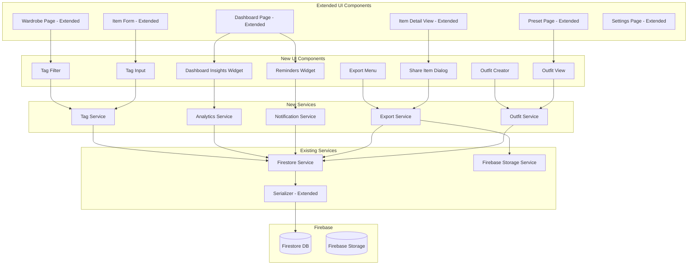

# Design Document: Wardrobe Manager Advanced Features

## Overview

This design extends the existing Wardrobe Manager application with advanced features that enhance wardrobe management capabilities. The design builds directly on top of the existing architecture, data models, and components from the wardrobe-manager spec.

Key additions include:
- **Tags System**: Flexible multi-select tagging separate from categories, with preset and custom tags
- **Permanent Optional Fields**: Value Bought, Care Instructions, and Notes fields that cannot be removed but are optional to fill
- **Usage Tracking**: Track when items are worn with usageCount and lastWornDate
- **Dashboard Insights**: Analytics showing wardrobe value, most/least worn items, unworn items, and statistics
- **Notifications/Reminders**: Dashboard-based reminders for unworn items, seasonal rotation, and maintenance
- **Sharing & Export**: Share individual items, export wardrobe as PDF/images/JSON/CSV
- **Laundry Tracking**: Last Cleaned Date field template and care instructions display
- **Outfit Creation**: Combine multiple items into outfits, save to Presets, track outfit usage

All features integrate seamlessly with the existing field-driven data model, Firebase backend, and React component architecture.

## Architecture

The advanced features extend the existing architecture without modifying core components. New components and services are added alongside existing ones.



### Technology Stack

The advanced features use the same technology stack as the base wardrobe-manager:

| Layer | Technology |
|-------|-----------|
| UI Framework | React 18+ with TypeScript |
| State Management | React Context + useReducer (or Zustand) |
| Styling | Tailwind CSS (mobile-first) |
| Backend | Firebase (Firestore, Storage) |
| PDF Generation | jsPDF + jsPDF-AutoTable |
| Image Processing | HTML Canvas API |
| CSV Generation | Built-in string manipulation |
| Testing | Vitest + fast-check |

### Data Flow Extensions

1. **Tag Management**: User types tag → Tag_Service validates/creates → persist to Firestore tags collection → update Item with tag references
2. **Usage Tracking**: User clicks "Worn This Week" → increment usageCount, update lastWornDate → persist to Firestore → update UI
3. **Dashboard Insights**: Load all items → Analytics_Service computes statistics → display on Dashboard
4. **Export**: User selects export format → Export_Service gathers data → generate file → trigger browser download
5. **Outfit Creation**: User selects items → Outfit_Service creates outfit preset → persist to Firestore → display in Presets

## Components and Interfaces

### New UI Components

**TagInput**: Multi-select tag input component with autocomplete. Displays preset tags and custom tags. Allows creating new tags by typing. Shows selected tags as removable chips.

**TagFilter**: Filter component on WardrobePage for selecting one or more tags. Displays all available tags with counts. Supports multi-select with OR logic between selected tags.

**DashboardInsightsWidget**: Dashboard component displaying:
- Total wardrobe value (sum of Value_Bought)
- Wardrobe statistics (total items, avg cost per item, avg cost per wear)
- Most worn items (top 5 by usageCount)
- Least worn items (bottom 5 by usageCount)
- Unworn items (not worn in 6 months)

**RemindersWidget**: Dashboard component displaying:
- Unworn items reminder (items not worn in 6 months)
- Seasonal rotation suggestions (based on current season and item tags)
- Maintenance reminders (based on care instructions and usage)
- Dismissible reminders (hidden for 30 days after dismissal)

**ExportMenu**: Dropdown menu in Settings or Dashboard with export options:
- Export as PDF
- Export as Images (grid)
- Export as JSON
- Export as CSV

**ShareItemDialog**: Modal dialog for sharing an individual item. Generates a composite image with item photo and text details. Triggers download.

**OutfitCreator**: Multi-step form for creating outfits:
1. Select items from wardrobe (multi-select with thumbnails)
2. Name the outfit
3. Optionally add outfit-level tags
4. Save to Presets

**OutfitView**: Display component for viewing outfit details. Shows all items in the outfit with thumbnails. Displays "Worn This Week" button. Shows outfit usageCount and lastWornDate.

**WornThisWeekButton**: Button component that increments usageCount and updates lastWornDate. Used on both Item Detail View and Outfit View. Shows visual feedback on click (e.g., checkmark animation).

### Extended UI Components

**ItemForm (Extended)**: 
- Adds TagInput component for selecting/creating tags
- Displays permanent fields (Value Bought, Care Instructions, Notes) with visual indicator that they're permanent
- All permanent fields are optional (no required validation)

**ItemDetailView (Extended)**:
- Displays WornThisWeekButton
- Shows usageCount and lastWornDate
- Displays tags as chips
- Prominently displays Care Instructions if present
- Adds ShareItemDialog trigger button

**WardrobePage (Extended)**:
- Adds TagFilter component
- Tag filter combines with existing filters using AND logic
- Multiple selected tags use OR logic (item must have at least one selected tag)
- Displays tags on item cards

**DashboardPage (Extended)**:
- Adds DashboardInsightsWidget
- Adds RemindersWidget
- Maintains existing dashboard functionality (item count, category breakdown, quick links)

**PresetPage (Extended)**:
- Displays both individual PresetItems and Outfit_Presets
- Outfit cards show multiple item thumbnails in a grid
- Clicking an outfit opens OutfitView

**SettingsPage (Extended)**:
- Adds ExportMenu
- Field configuration shows permanent fields with "Permanent" badge and disabled delete button
- Adds notification preferences section (enable/disable browser notifications)

### Service Interfaces

```typescript
// --- Extended Item Model ---

interface Item {
  // ... existing fields from wardrobe-manager ...
  tags: string[];                          // array of tag names
  usageCount: number;                      // number of times worn
  lastWornDate: Date | null;               // last time item was worn
}

// --- Tag ---

interface Tag {
  name: string;                            // tag name (e.g., "sport", "office")
  isPreset: boolean;                       // true for preset tags, false for custom
  createdAt: Date;
}

// --- Outfit ---

interface Outfit {
  id: string;
  name: string;
  itemIds: string[];                       // references to Item IDs
  tags: string[];                          // outfit-level tags
  usageCount: number;
  lastWornDate: Date | null;
  createdAt: Date;
  updatedAt: Date;
}

// --- Dashboard Statistics ---

interface WardrobeStatistics {
  totalItems: number;
  totalValue: number;                      // sum of all Value_Bought
  averageCostPerItem: number;              // totalValue / totalItems
  averageCostPerWear: number;              // sum of (Value_Bought / usageCount) / items with usageCount > 0
  itemsWithValue: number;                  // count of items with Value_Bought > 0
  itemsWorn: number;                       // count of items with usageCount > 0
}

interface UsageInsights {
  mostWornItems: Item[];                   // top 5 by usageCount
  leastWornItems: Item[];                  // bottom 5 by usageCount (excluding unworn)
  unwornItems: Item[];                     // lastWornDate null or > 6 months ago
}

// --- Reminder ---

interface Reminder {
  id: string;
  type: "unworn" | "seasonal" | "maintenance";
  title: string;
  message: string;
  itemIds: string[];                       // related items
  dismissedUntil: Date | null;            // null if not dismissed
  createdAt: Date;
}

// --- Export Options ---

interface ExportOptions {
  format: "pdf" | "images" | "json" | "csv";
  includeImages: boolean;
  includeAllFields: boolean;
  filterByCategory?: string;
  filterByTags?: string[];
}

// --- Services ---

interface TagService {
  getAllTags(): Promise<Tag[]>;
  getPresetTags(): Tag[];                  // returns hardcoded preset tags
  createCustomTag(name: string): Promise<Tag>;
  getItemTags(itemId: string): Promise<string[]>;
  addTagToItem(itemId: string, tagName: string): Promise<void>;
  removeTagFromItem(itemId: string, tagName: string): Promise<void>;
  getItemsByTag(tagName: string): Promise<Item[]>;
  getItemsByTags(tagNames: string[]): Promise<Item[]>;  // OR logic
}

interface AnalyticsService {
  calculateWardrobeStatistics(items: Item[]): WardrobeStatistics;
  getUsageInsights(items: Item[]): UsageInsights;
  getMostWornItems(items: Item[], limit: number): Item[];
  getLeastWornItems(items: Item[], limit: number): Item[];
  getUnwornItems(items: Item[], monthsThreshold: number): Item[];
  calculateCostPerWear(item: Item): number | null;  // null if never worn
}

interface NotificationService {
  getActiveReminders(): Promise<Reminder[]>;
  createUnwornReminder(items: Item[]): Promise<Reminder>;
  createSeasonalReminder(season: string, items: Item[]): Promise<Reminder>;
  createMaintenanceReminder(items: Item[]): Promise<Reminder>;
  dismissReminder(reminderId: string, daysUntil: number): Promise<void>;
  sendBrowserNotification(reminder: Reminder): Promise<void>;
  requestNotificationPermission(): Promise<NotificationPermission>;
}

interface ExportService {
  exportToPDF(items: Item[], options: ExportOptions): Promise<Blob>;
  exportToImages(items: Item[], options: ExportOptions): Promise<Blob>;
  exportToJSON(items: Item[], options: ExportOptions): Promise<Blob>;
  exportToCSV(items: Item[], options: ExportOptions): Promise<Blob>;
  shareItem(item: Item): Promise<Blob>;    // generates composite image
  triggerDownload(blob: Blob, filename: string): void;
}

interface OutfitService {
  getOutfits(): Promise<Outfit[]>;
  getOutfit(id: string): Promise<Outfit | null>;
  createOutfit(outfit: Omit<Outfit, "id" | "createdAt" | "updatedAt">): Promise<Outfit>;
  updateOutfit(id: string, updates: Partial<Outfit>): Promise<Outfit>;
  deleteOutfit(id: string): Promise<void>;
  markOutfitWorn(id: string): Promise<Outfit>;  // increments usageCount, updates lastWornDate
  removeItemFromOutfits(itemId: string): Promise<void>;  // removes item reference from all outfits
  deleteEmptyOutfits(): Promise<void>;     // deletes outfits with zero items
  getOutfitItems(outfit: Outfit): Promise<Item[]>;  // resolves item references
}

// Extended Firestore Service
interface FirestoreService {
  // ... existing methods from wardrobe-manager ...
  
  // Usage tracking
  markItemWorn(id: string): Promise<Item>;  // increments usageCount, updates lastWornDate
  
  // Tags
  getTags(): Promise<Tag[]>;
  createTag(tag: Omit<Tag, "createdAt">): Promise<Tag>;
  
  // Outfits
  getOutfits(): Promise<Outfit[]>;
  createOutfit(outfit: Omit<Outfit, "id" | "createdAt" | "updatedAt">): Promise<Outfit>;
  updateOutfit(id: string, updates: Partial<Outfit>): Promise<Outfit>;
  deleteOutfit(id: string): Promise<void>;
  
  // Reminders
  getReminders(): Promise<Reminder[]>;
  createReminder(reminder: Omit<Reminder, "id" | "createdAt">): Promise<Reminder>;
  updateReminder(id: string, updates: Partial<Reminder>): Promise<void>;
  deleteReminder(id: string): Promise<void>;
}

// Extended Serializer
interface ItemSerializer {
  // ... existing methods from wardrobe-manager ...
  
  serializeTags(tags: string[]): string[];
  deserializeTags(raw: unknown): string[];
  serializeOutfit(outfit: Outfit): Record<string, unknown>;
  deserializeOutfit(doc: Record<string, unknown>): Outfit;
}
```

### Preset Tags

The system ships with these preset tags (users can create additional custom tags):

- `#sport` - Athletic and sports activities
- `#office` - Professional office wear
- `#casual` - Everyday casual wear
- `#formal` - Formal events and occasions
- `#summer` - Summer season clothing
- `#winter` - Winter season clothing
- `#rain` - Rain and wet weather gear
- `#travel` - Travel-friendly items
- `#party` - Party and social events
- `#comfortable` - Comfort-focused items
- `#vacation` - Vacation and leisure wear

### Permanent Fields

These fields are added to the global field configuration and cannot be removed (but are optional to fill):

| Field Name | Field Type | Required | Description |
|------------|-----------|----------|-------------|
| Value Bought | number | No | Purchase price of the item |
| Care Instructions | long_text | No | Washing, cleaning, and care instructions |
| Notes | long_text | No | General notes about the item |

In the Settings field configuration UI, these fields display with a "Permanent" badge and the delete button is disabled.

### Optional Field Templates

In addition to permanent fields, users can optionally add this field template:

| Field Name | Field Type | Required | Description |
|------------|-----------|----------|-------------|
| Last Cleaned Date | date | No | Date when item was last washed/cleaned |

This is not added by default but is available as a quick-add template in the field configuration UI.

## Data Models

### Firestore Collections (Extended)

```
/users/{userId}/
  profile/
    personMeasurements    → PersonProfile document
    settings              → { darkMode: boolean, notificationsEnabled: boolean }
  items/{itemId}          → Item documents (extended with tags, usageCount, lastWornDate)
  wishlist/{itemId}       → WishlistItem documents
  config/
    categories            → { categories: Category[] } (extended with permanent fields)
  presets/{presetId}      → PresetItem documents
  outfits/{outfitId}      → Outfit documents
  tags/{tagName}          → Tag documents
  reminders/{reminderId}  → Reminder documents
```

### Extended Item Document Schema

```json
{
  "id": "item_123",
  "categoryId": "cat_tops",
  "subcategoryId": "sub_tshirts",
  "imageUrl": "https://firebasestorage.googleapis.com/...",
  "fitConfidence": "exact",
  "materialStretch": false,
  "tags": ["sport", "casual", "summer"],
  "usageCount": 12,
  "lastWornDate": "2024-03-10T00:00:00Z",
  "fieldValues": {
    "field_name": "Blue Running Shirt",
    "field_colors": ["#1E3A5F"],
    "field_material": "Polyester",
    "field_value_bought": 29.99,
    "field_care_instructions": "Machine wash cold, tumble dry low",
    "field_notes": "Great for morning runs"
  },
  "createdAt": "2024-01-15T10:30:00Z",
  "updatedAt": "2024-03-10T08:15:00Z"
}
```

### Outfit Document Schema

```json
{
  "id": "outfit_456",
  "name": "Office Casual Friday",
  "itemIds": ["item_123", "item_456", "item_789"],
  "tags": ["office", "casual"],
  "usageCount": 5,
  "lastWornDate": "2024-03-08T00:00:00Z",
  "createdAt": "2024-02-01T14:20:00Z",
  "updatedAt": "2024-03-08T07:30:00Z"
}
```

### Tag Document Schema

```json
{
  "name": "sport",
  "isPreset": true,
  "createdAt": "2024-01-01T00:00:00Z"
}
```

### Reminder Document Schema

```json
{
  "id": "reminder_789",
  "type": "unworn",
  "title": "Items Not Worn Recently",
  "message": "You have 8 items that haven't been worn in over 6 months",
  "itemIds": ["item_111", "item_222", "item_333"],
  "dismissedUntil": null,
  "createdAt": "2024-03-15T00:00:00Z"
}
```

### Serialization Extensions

The `ItemSerializer` is extended to handle new fields:

- **tags**: Stored as array of strings, validated to ensure all are non-empty strings
- **usageCount**: Stored as number, defaults to 0 if missing
- **lastWornDate**: Stored as ISO 8601 string or null, parsed to Date object or null
- **Outfit**: Serialized with itemIds array, tags array, and usage tracking fields

Round-trip consistency must be maintained: `deserialize(serialize(item))` produces an equivalent item with identical tags and usage data.

### Dashboard Calculations

**Wardrobe Value**:
```typescript
totalValue = items.reduce((sum, item) => {
  const valueBought = item.fieldValues.field_value_bought;
  return sum + (typeof valueBought === 'number' ? valueBought : 0);
}, 0);
```

**Average Cost Per Item**:
```typescript
itemsWithValue = items.filter(item => 
  typeof item.fieldValues.field_value_bought === 'number' && 
  item.fieldValues.field_value_bought > 0
);
averageCostPerItem = itemsWithValue.length > 0 
  ? totalValue / itemsWithValue.length 
  : 0;
```

**Cost Per Wear** (per item):
```typescript
costPerWear = item.usageCount > 0 
  ? (item.fieldValues.field_value_bought || 0) / item.usageCount 
  : null;  // null indicates never worn
```

**Average Cost Per Wear** (across wardrobe):
```typescript
wornItems = items.filter(item => item.usageCount > 0);
totalCostPerWear = wornItems.reduce((sum, item) => {
  const valueBought = item.fieldValues.field_value_bought;
  if (typeof valueBought === 'number' && valueBought > 0) {
    return sum + (valueBought / item.usageCount);
  }
  return sum;
}, 0);
averageCostPerWear = wornItems.length > 0 
  ? totalCostPerWear / wornItems.length 
  : 0;
```

**Most/Least Worn Items**:
```typescript
// Most worn: sort by usageCount descending, then lastWornDate descending
mostWorn = items
  .filter(item => item.usageCount > 0)
  .sort((a, b) => {
    if (b.usageCount !== a.usageCount) {
      return b.usageCount - a.usageCount;
    }
    // Tiebreaker: most recent lastWornDate first
    const dateA = a.lastWornDate?.getTime() || 0;
    const dateB = b.lastWornDate?.getTime() || 0;
    return dateB - dateA;
  })
  .slice(0, 5);

// Least worn: sort by usageCount ascending (excluding unworn), then lastWornDate ascending
leastWorn = items
  .filter(item => item.usageCount > 0)
  .sort((a, b) => {
    if (a.usageCount !== b.usageCount) {
      return a.usageCount - b.usageCount;
    }
    // Tiebreaker: least recent lastWornDate first
    const dateA = a.lastWornDate?.getTime() || 0;
    const dateB = b.lastWornDate?.getTime() || 0;
    return dateA - dateB;
  })
  .slice(0, 5);
```

**Unworn Items**:
```typescript
const sixMonthsAgo = new Date();
sixMonthsAgo.setMonth(sixMonthsAgo.getMonth() - 6);

unwornItems = items.filter(item => 
  item.lastWornDate === null || 
  item.lastWornDate < sixMonthsAgo
);
```

### Export Formats

**PDF Export**:
- Uses jsPDF library
- Each item gets a section with image (if available) and all field values
- Tags displayed as comma-separated list
- Includes header with wardrobe statistics
- Page breaks between items if needed

**Images Export**:
- Uses HTML Canvas API
- Creates a grid layout (e.g., 3 columns)
- Each cell contains item thumbnail
- Only includes items with images
- Exports as PNG

**JSON Export**:
```json
{
  "exportDate": "2024-03-15T10:00:00Z",
  "totalItems": 42,
  "items": [
    {
      "id": "item_123",
      "categoryId": "cat_tops",
      "tags": ["sport", "casual"],
      "usageCount": 12,
      "lastWornDate": "2024-03-10T00:00:00Z",
      "fieldValues": { ... },
      "createdAt": "2024-01-15T10:30:00Z"
    }
  ]
}
```

**CSV Export**:
```csv
ID,Category,Subcategory,Name,Tags,Usage Count,Last Worn,Value Bought,Care Instructions,Notes,Created At
item_123,Tops,T-Shirts,Blue Running Shirt,"sport,casual,summer",12,2024-03-10,29.99,"Machine wash cold",Great for morning runs,2024-01-15
```

### Share Item Format

The Share Item feature generates a composite image:
- Top section: Item photo (scaled to fit)
- Bottom section: Text overlay with:
  - Item name (large font)
  - Category and subcategory
  - Tags (as chips)
  - Key field values (brand, material, colors)
- Background: Subtle gradient or solid color
- Export as PNG with item name as filename

### Notification System

**Browser Notifications**:
- Request permission on first app load (if not already granted)
- Store permission status in local storage
- Send notifications for:
  - Unworn items (weekly check)
  - Seasonal rotation (at season change)
  - Maintenance reminders (based on usage and care instructions)

**Notification Timing**:
- Unworn items: Check weekly, notify if items haven't been worn in 6+ months
- Seasonal rotation: Check monthly, notify at season boundaries (Mar 1, Jun 1, Sep 1, Dec 1)
- Maintenance: Check after every 10 wears or 30 days since last cleaned

**Dismissal Logic**:
- User can dismiss any reminder
- Dismissed reminders are hidden for 30 days
- After 30 days, reminder can reappear if condition still met

### Outfit Management

**Creating Outfits**:
1. User navigates to "Create Outfit" (button on Wardrobe or Presets page)
2. Multi-select mode activates on wardrobe
3. User selects 2+ items
4. User enters outfit name and optional tags
5. Outfit saved to Firestore with item ID references

**Viewing Outfits**:
- Outfits appear on Presets page alongside individual preset items
- Outfit cards show grid of item thumbnails (2x2 or 3x3 depending on item count)
- Clicking outfit opens detail view with all items

**Wearing Outfits**:
- "Worn This Week" button on outfit detail view
- Increments outfit usageCount and updates outfit lastWornDate
- Also increments usageCount for each individual item in the outfit
- Individual item lastWornDate updated to match outfit lastWornDate

**Outfit Integrity**:
- If an item is deleted, it's removed from all outfit itemIds arrays
- After item removal, check if outfit has zero items
- If zero items, automatically delete the outfit
- This cleanup happens in the `removeItemFromOutfits` service method

## Correctness Properties

*A property is a characteristic or behavior that should hold true across all valid executions of a system — essentially, a formal statement about what the system should do. Properties serve as the bridge between human-readable specifications and machine-verifiable correctness guarantees.*


The following properties were derived from the acceptance criteria through systematic analysis. Each property is universally quantified and suitable for property-based testing.

### Property 1: Custom tag creation and availability

*For any* non-empty tag name that doesn't already exist, creating a custom tag shall add it to the available tags list and mark it as non-preset.

**Validates: Requirements 1.3**

### Property 2: Tag storage completeness

*For any* item and any set of selected tags, storing the item shall preserve all selected tags in the item record.

**Validates: Requirements 1.4**

### Property 3: Tag filter returns matching items

*For any* list of items and any set of selected tags, filtering by those tags shall return exactly those items that have at least one of the selected tags (OR logic between tags).

**Validates: Requirements 1.5, 9.3**

### Property 4: Usage tracking increments correctly

*For any* item, clicking "Worn This Week" shall increment usageCount by exactly 1 and update lastWornDate to the current date.

**Validates: Requirements 3.2**

### Property 5: New items initialize usage tracking

*For any* newly created item, usageCount shall be initialized to 0 and lastWornDate shall be null.

**Validates: Requirements 3.3**

### Property 6: Usage tracking persistence

*For any* item with usageCount and lastWornDate values, serializing and persisting the item shall preserve both values exactly.

**Validates: Requirements 3.5**

### Property 7: Wardrobe value calculation

*For any* list of items, the total wardrobe value shall equal the sum of all Value_Bought field values, treating missing or non-numeric values as 0.

**Validates: Requirements 4.1**

### Property 8: Most worn items sorting

*For any* list of items, the most worn items list shall contain the top N items sorted by usageCount descending, with lastWornDate as tiebreaker (most recent first).

**Validates: Requirements 4.2, 11.5**

### Property 9: Least worn items sorting

*For any* list of items with usageCount > 0, the least worn items list shall contain the bottom N items sorted by usageCount ascending, with lastWornDate as tiebreaker (least recent first).

**Validates: Requirements 4.3**

### Property 10: Unworn items filtering

*For any* list of items and any date threshold, unworn items shall include exactly those items where lastWornDate is null or earlier than the threshold date.

**Validates: Requirements 4.4**

### Property 11: Wardrobe statistics calculation

*For any* list of items, wardrobe statistics shall correctly compute: total items (count), total value (sum of Value_Bought), average cost per item (total value / items with value), and average cost per wear (sum of cost-per-wear for worn items / count of worn items).

**Validates: Requirements 4.5, 4.6, 4.7**

### Property 12: Reminder dismissal duration

*For any* reminder, dismissing it shall prevent it from appearing again for exactly 30 days, after which it may reappear if conditions are still met.

**Validates: Requirements 5.5**

### Property 13: Seasonal reminder filtering

*For any* list of items and any season, seasonal rotation reminders shall include only items with tags matching that season.

**Validates: Requirements 5.2**

### Property 14: Maintenance reminder filtering

*For any* list of items, maintenance reminders shall include only items with Care_Instructions containing keywords like "dry clean", "repair", or similar maintenance terms.

**Validates: Requirements 5.3, 7.5**

### Property 15: JSON export completeness

*For any* list of items, exporting to JSON shall include all fields for each item: id, categoryId, subcategoryId, tags, usageCount, lastWornDate, fieldValues, and timestamps.

**Validates: Requirements 6.4, 12.1**

### Property 16: CSV export structure

*For any* list of items and field definitions, exporting to CSV shall produce a file with one column per field definition plus columns for tags, usageCount, and lastWornDate.

**Validates: Requirements 6.5, 12.2**

### Property 17: Image export filtering

*For any* list of items, exporting to images shall include exactly those items that have non-null imageUrl values, excluding all items without images.

**Validates: Requirements 12.4**

### Property 18: Outfit creation with item references

*For any* set of selected items and outfit name, creating an outfit shall produce an Outfit_Preset with itemIds array containing exactly the IDs of all selected items.

**Validates: Requirements 8.2**

### Property 19: Outfit worn cascades to items

*For any* outfit, marking it as worn shall increment both the outfit's usageCount and the usageCount of every item referenced in the outfit's itemIds array.

**Validates: Requirements 8.6, 8.7**

### Property 20: Item deletion removes from outfits

*For any* item that is part of one or more outfits, deleting the item shall remove its ID from all outfit itemIds arrays.

**Validates: Requirements 8.8**

### Property 21: Empty outfits are deleted

*For any* outfit, if all items are removed such that itemIds becomes empty, the outfit shall be automatically deleted.

**Validates: Requirements 8.9**

### Property 22: Combined filter logic

*For any* list of items, applying tag filters, category filters, and favorite filters together shall return items matching ALL filter types (AND logic between filter types, OR logic within tag selections).

**Validates: Requirements 9.1, 9.2**

### Property 23: Clear all filters shows all items

*For any* list of items, clearing all filters (tags, category, favorite, search) shall result in displaying the complete list of items.

**Validates: Requirements 9.4**

### Property 24: Item serialization round-trip with tags

*For any* valid Item object with tags array, serializing then deserializing shall produce an equivalent Item with identical tags in the same order.

**Validates: Requirements 10.1, 10.2, 10.5**

### Property 25: Outfit serialization round-trip

*For any* valid Outfit object with itemIds array, serializing then deserializing shall produce an equivalent Outfit with identical itemIds in the same order.

**Validates: Requirements 10.3, 10.4, 10.6**

### Property 26: JSON export/import round-trip

*For any* list of items, exporting to JSON then importing shall preserve all item data including tags, usageCount, lastWornDate, and all field values.

**Validates: Requirements 12.5**

## Error Handling

### Tag Input Errors
- Empty tag names: prevent creation, show validation error
- Duplicate tag names: prevent creation, show "tag already exists" message
- Tag name with invalid characters: sanitize or reject with error message
- Maximum tag length exceeded: truncate or show error

### Usage Tracking Errors
- "Worn This Week" clicked multiple times rapidly: debounce to prevent duplicate increments
- lastWornDate in the future: validate and reject with error
- Negative usageCount: validate and reset to 0

### Dashboard Calculation Errors
- Division by zero in averages: return 0 or null, display "N/A" in UI
- Invalid Value_Bought values (negative, non-numeric): treat as 0, log warning
- Missing or corrupted usage data: skip item in calculations, log error

### Export Errors
- PDF generation failure: show error toast, offer retry
- Image canvas errors: show error, skip problematic items
- JSON serialization errors: show error with item details, offer partial export
- CSV encoding errors: use UTF-8 with BOM, handle special characters
- File size too large: warn user, offer filtered export
- Browser download blocked: show instructions to allow downloads

### Outfit Management Errors
- Creating outfit with zero items: prevent creation, show validation error
- Creating outfit with deleted items: filter out deleted items, warn user
- Outfit item references broken: show placeholder for missing items, offer to remove
- Circular references: prevent during creation
- Maximum items per outfit exceeded: enforce limit (e.g., 10 items), show error

### Notification Errors
- Browser notification permission denied: show in-app reminders only, hide notification toggle
- Notification API not supported: gracefully degrade to in-app reminders only
- Notification send failure: log error, continue with in-app display

### Reminder Errors
- Reminder calculation errors: log error, skip problematic items
- Dismissal date in past: treat as not dismissed
- Corrupted reminder data: delete reminder, recreate if needed

## Testing Strategy

### Testing Framework

- **Unit & Integration Tests**: Vitest
- **Property-Based Tests**: fast-check (with Vitest as runner)
- **Component Tests**: React Testing Library
- **Minimum iterations**: 100 per property-based test

### Unit Tests

Unit tests cover specific examples, edge cases, and error conditions:

- Tag input validation (empty, duplicate, special characters)
- Usage tracking with specific dates and counts
- Dashboard calculations with edge cases (zero items, no values, all unworn)
- Export format validation (PDF structure, CSV headers, JSON schema)
- Outfit creation with specific item combinations
- Reminder dismissal with specific dates
- Seasonal tag matching with specific seasons
- Filter combinations with specific item sets

### Property-Based Tests

Each correctness property from the design document is implemented as a single property-based test using fast-check. Each test runs a minimum of 100 iterations with randomly generated inputs.

Tests are tagged with the format: `Feature: wardrobe-manager-advanced-features, Property {number}: {title}`

Key generators needed:
- `arbitraryTag()`: generates random tag names (preset and custom)
- `arbitraryItemWithTags()`: generates items with random tag arrays
- `arbitraryUsageData()`: generates usageCount and lastWornDate values
- `arbitraryOutfit()`: generates outfits with random item references
- `arbitraryReminder()`: generates reminders with random types and dismissal dates
- `arbitraryExportOptions()`: generates export configuration options
- `arbitraryDateInPast()`: generates dates in the past for testing thresholds
- `arbitraryItemWithValue()`: generates items with Value_Bought field

### Test Organization

```
src/
  __tests__/
    properties/
      tag-creation.property.test.ts           # Property 1
      tag-storage.property.test.ts            # Property 2
      tag-filter.property.test.ts             # Property 3
      usage-tracking.property.test.ts         # Property 4, 5, 6
      wardrobe-value.property.test.ts         # Property 7
      most-worn-sorting.property.test.ts      # Property 8
      least-worn-sorting.property.test.ts     # Property 9
      unworn-filter.property.test.ts          # Property 10
      statistics-calculation.property.test.ts # Property 11
      reminder-dismissal.property.test.ts     # Property 12
      seasonal-reminder.property.test.ts      # Property 13
      maintenance-reminder.property.test.ts   # Property 14
      json-export.property.test.ts            # Property 15
      csv-export.property.test.ts             # Property 16
      image-export.property.test.ts           # Property 17
      outfit-creation.property.test.ts        # Property 18
      outfit-worn-cascade.property.test.ts    # Property 19
      item-deletion-outfits.property.test.ts  # Property 20
      empty-outfit-deletion.property.test.ts  # Property 21
      combined-filters.property.test.ts       # Property 22
      clear-filters.property.test.ts          # Property 23
      item-tags-roundtrip.property.test.ts    # Property 24
      outfit-roundtrip.property.test.ts       # Property 25
      json-roundtrip.property.test.ts         # Property 26
    unit/
      tag-input.test.ts
      usage-button.test.ts
      dashboard-insights.test.ts
      export-pdf.test.ts
      export-csv.test.ts
      export-json.test.ts
      share-item.test.ts
      outfit-creator.test.ts
      reminders-widget.test.ts
      seasonal-logic.test.ts
    generators/
      tag-generators.ts
      usage-generators.ts
      outfit-generators.ts
      reminder-generators.ts
      export-generators.ts
```

### Integration Testing

Integration tests verify interactions between new and existing components:

- Tag filtering combined with existing category/favorite filters
- Usage tracking updates reflected in dashboard statistics
- Outfit creation and display in Presets page
- Export functions accessing Firestore and Storage
- Reminder generation based on item data
- Outfit item deletion cascading to outfit cleanup

### Testing Dual Approach

- **Unit tests**: Focus on specific examples (e.g., exporting 3 items with specific tags, creating outfit with 2 specific items)
- **Property tests**: Verify universal properties across all inputs (e.g., any set of items exports correctly, any outfit creation preserves item references)
- Both are complementary and necessary for comprehensive coverage
